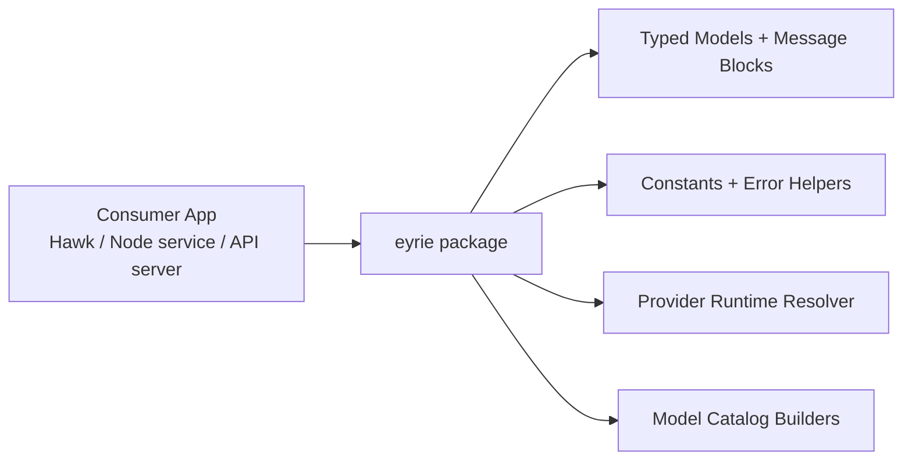
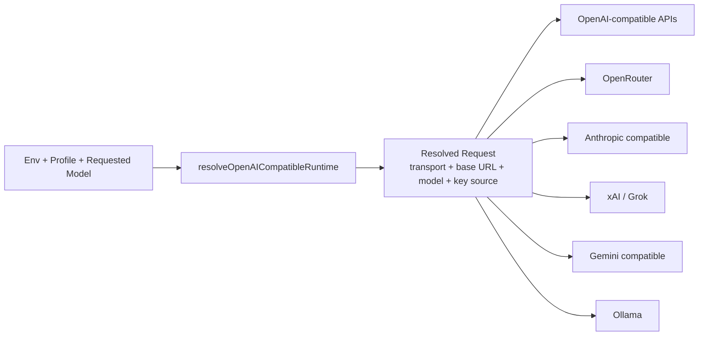

# Eyrie Architecture

## Component Overview

## Runtime Resolution Flow

## Scope

- Eyrie is the provider/runtime and model-catalog layer.
- It is designed for direct use by Hawk and any other TypeScript app.
