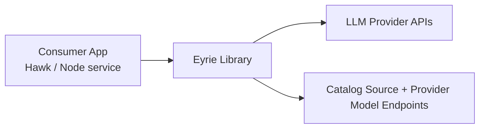
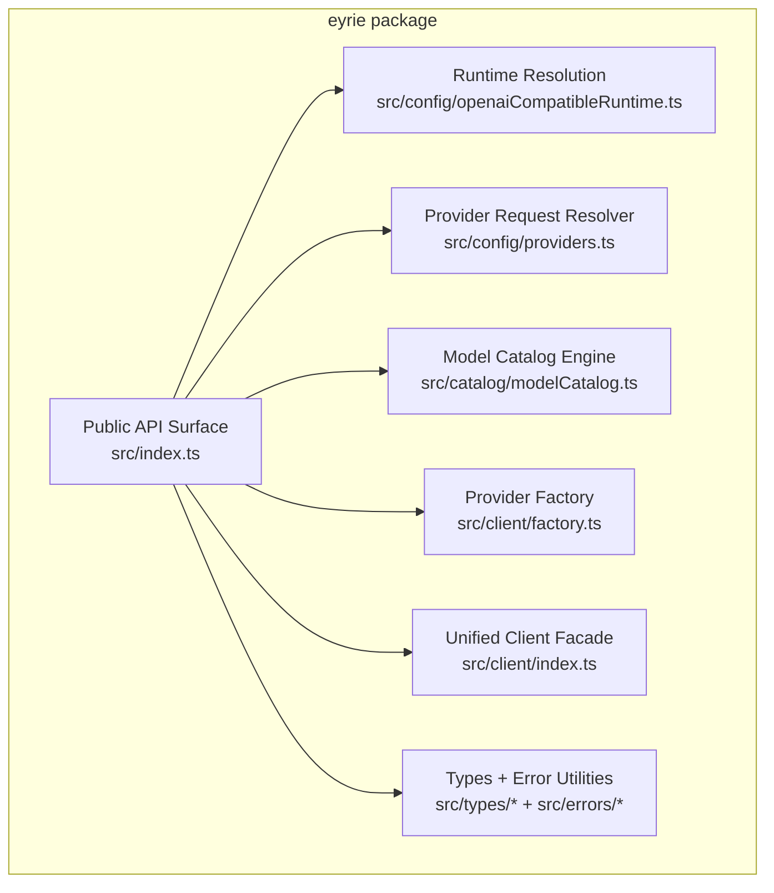
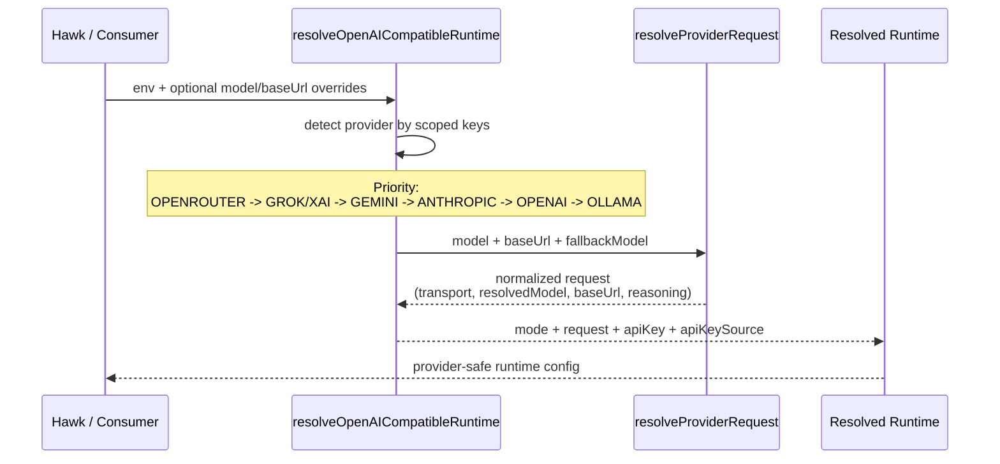
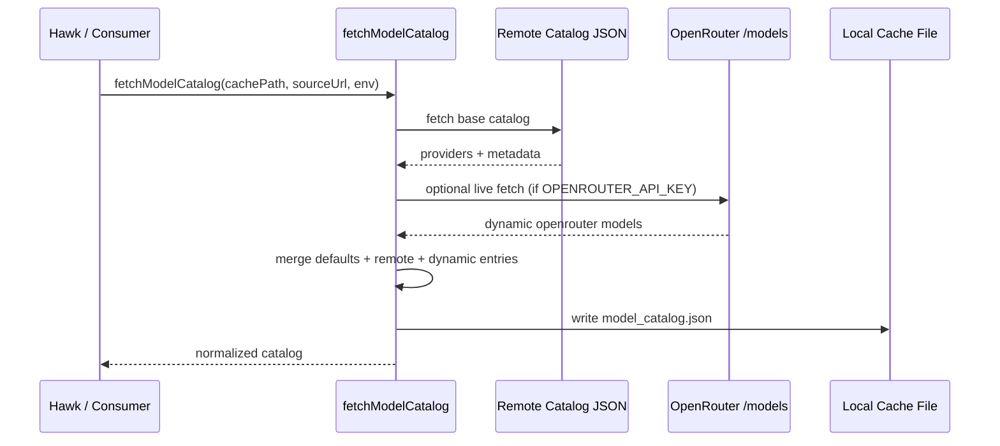

# Eyrie Architecture

Eyrie is the provider/runtime and model-catalog layer consumed by Hawk and other TypeScript apps.

## 1) Context (C4-L1)

## 2) Containers / Modules (C4-L2)

## 3) Runtime Resolution Flow (provider-scoped)

## 4) Model Catalog Flow

## 5) Design Notes

- Provider-scoped resolution prevents key/model leakage across providers.
- Catalog behavior is resilient: embedded defaults + cache fallback + best-effort live enrichment.
- Public API is centralized through `src/index.ts` to keep integration stable as internals evolve.
