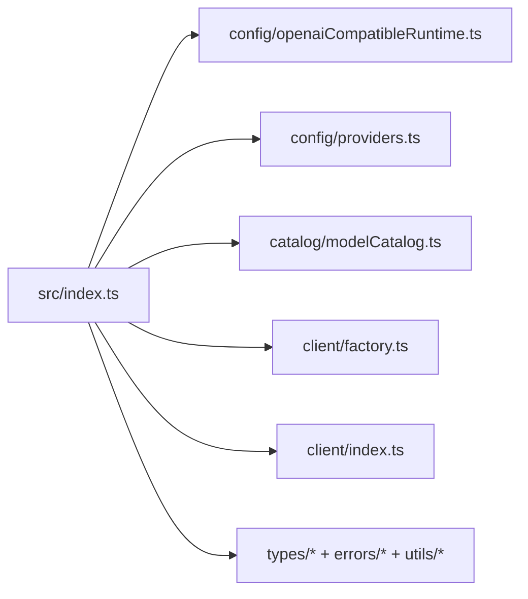
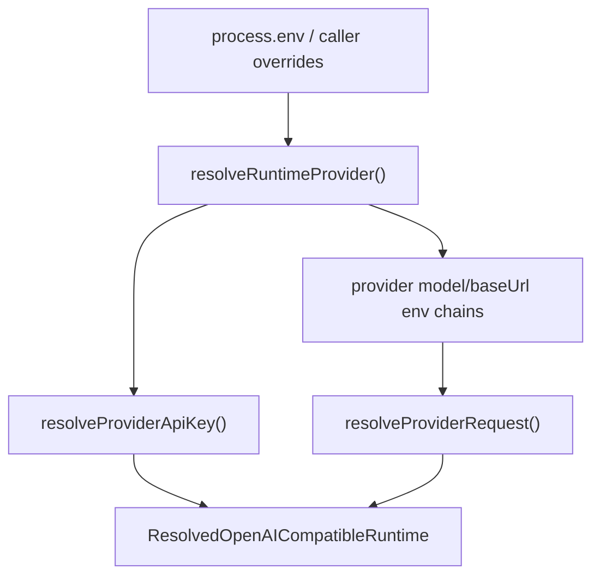
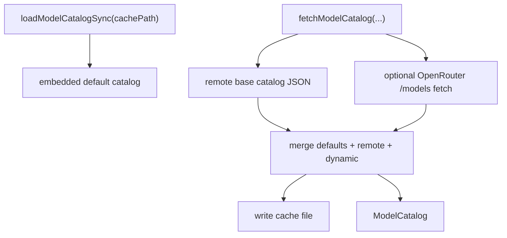
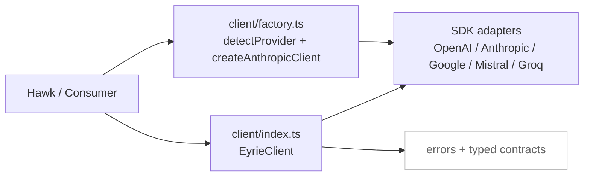
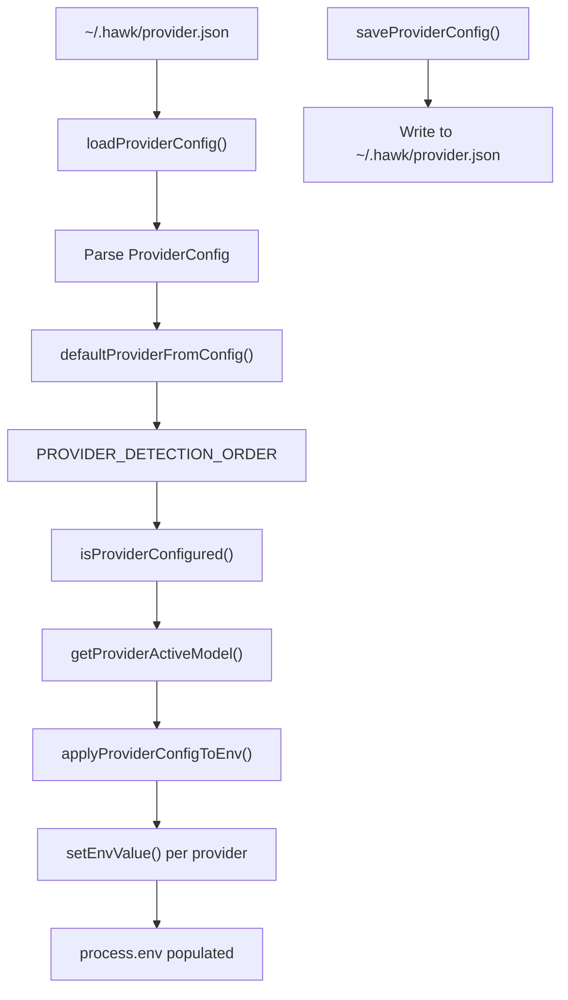

# Eyrie Components (C4-L3)

This document expands eyrie internals at component level for runtime resolution and model-catalog behavior.

## 1) Public API Surface and Module Wiring

## 2) Runtime Resolver Components

## 3) Catalog Engine Components

## 4) Provider Factory and Client Facade

## 5) Provider Configuration I/O Components

### Provider Config Flow
1. **Load** - `loadProviderConfig()` reads `~/.hawk/provider.json`
2. **Detect** - `defaultProviderFromConfig()` finds first configured provider by priority
3. **Resolve** - `getProviderActiveModel()` gets provider-specific model with fallback
4. **Apply** - `applyProviderConfigToEnv()` sets environment variables for the runtime

## 6) Contract Boundary

- Runtime and provider behavior is exported from `src/index.ts`; consumers should not depend on internal file layout.
- Provider precedence and catalog strategy are intentionally centralized to keep all consumers consistent.
- **Provider configuration I/O is now fully centralized in eyrie** - consumers (Hawk, etc.) delegate all config operations to eyrie.
