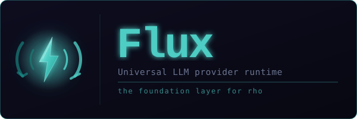

<div align="center">
  
  <br/><br/>

  <p>
    <a href="https://golang.org/"></a>
    <a href="LICENSE"></a>
    <a href="https://github.com/GrayCodeAI/eyrie/actions"></a>
    <a href="https://pkg.go.dev/github.com/hawk/eyrie"></a>
  </p>
</div>

---

## What is eyrie?

eyrie is the provider runtime that hawk sits on top of. It handles everything between hawk and the LLM APIs — authentication, model resolution, streaming, retries, rate limiting, and caching — so hawk can focus on being a great coding agent.

When hawk calls a model, eyrie figures out which provider to use, how to talk to it, and how to stream the response back. When hawk switches from Anthropic to Ollama, eyrie handles the translation. When an API returns a 529, eyrie retries with backoff. When a response hits `max_tokens`, eyrie continues automatically.

hawk never talks to an LLM API directly. eyrie does.

## What eyrie handles for hawk

| Concern | What eyrie does |
|---------|----------------|
| **Provider routing** | Detects active provider from env vars, config file, or explicit key |
| **Model resolution** | Maps abstract tiers (opus/sonnet/haiku) to concrete model IDs per provider |
| **Streaming** | Parses SSE for Anthropic and OpenAI formats — text, tool calls, thinking blocks |
| **Reliability** | Retries on 429/500/529 with exponential backoff and `Retry-After` support |
| **Long outputs** | Auto-continues when `stop_reason == max_tokens` |
| **Cost control** | Anthropic prompt caching breakpoints on system prompt and conversation prefix |
| **Rate limiting** | Token bucket per provider — prevents hitting API limits |
| **Config** | Reads/writes `~/.hawk/provider.json`, applies to env vars |
| **Model catalog** | Embedded pricing + context windows for all providers, live-fetched from OpenRouter |
| **Testing** | Mock provider — hawk's tests never need real API keys |

## Supported providers

| Provider | Set this | Notes |
|----------|----------|-------|
| **Anthropic** | `ANTHROPIC_API_KEY` | Default for hawk · supports thinking, caching |
| **OpenAI** | `OPENAI_API_KEY` | Full tool use + reasoning effort |
| **OpenRouter** | `OPENROUTER_API_KEY` | 200+ models via one key |
| **Grok (xAI)** | `XAI_API_KEY` | |
| **Gemini** | `GEMINI_API_KEY` | |
| **CanopyWave** | `CANOPYWAVE_API_KEY` | |
| **Ollama** | `OLLAMA_BASE_URL` | Local models, no key needed |
| **OpenCodeGo** | `OPENCODEGO_API_KEY` | |

eyrie detects which provider to use automatically — in the order above.

## How hawk uses eyrie

```go
// hawk creates a client once at startup
c := client.NewEyrieClient(&client.EyrieConfig{
    Provider: client.DetectProvider(), // reads from env / config file
})

// hawk streams a response
sr, err := c.StreamChat(ctx, conversation, client.ChatOptions{
    Model: catalog.GetProviderDefaultModel(provider, &cat),
})
defer sr.Close()

for evt := range sr.Events {
    switch evt.Type {
    case "content":   // stream text to terminal
    case "tool_call": // execute tool, append result
    case "thinking":  // show thinking indicator
    case "done":      // response complete
    }
}

// When a response hits max_tokens, eyrie continues automatically
resp, err := client.ChatWithContinuation(ctx, provider, messages,
    client.ChatOptions{Model: model},
    client.DefaultContinuationConfig(),
)
```

## Provider config file

hawk stores provider config at `~/.hawk/provider.json`. eyrie owns this file.

```go
cfg := config.LoadProviderConfig("")        // load
config.ApplyProviderConfigToEnv(cfg, false, nil) // apply to env
config.SaveProviderConfig(cfg, "")          // save
```

## Model catalog

eyrie ships with an embedded catalog of every supported model — pricing, context windows, max output. hawk uses this for cost tracking and model selection.

```go
cat := catalog.DefaultModelCatalog()

// Get the best model for a tier
model := catalog.GetPreferredProviderModel("anthropic", catalog.TierSonnet, &cat)
// → "claude-sonnet-4-6"

// Check if a model is deprecated
warn := catalog.GetModelDeprecationWarning("claude-3-7-sonnet", "anthropic")
// → "⚠ Claude 3.7 Sonnet will be retired on February 19, 2026..."
```

## Testing hawk without API keys

```go
mock := client.NewMockProvider(client.MockModeFixed)
mock.Response = "Here is the code you asked for..."

// Inject into hawk's test suite — no real API calls
resp, _ := mock.Chat(ctx, messages, opts)
```

## Install

```bash
go get github.com/hawk/eyrie
```

Requires Go 1.26+. Zero external dependencies.

## License

[MIT](LICENSE) © 2026 GrayCode AI
