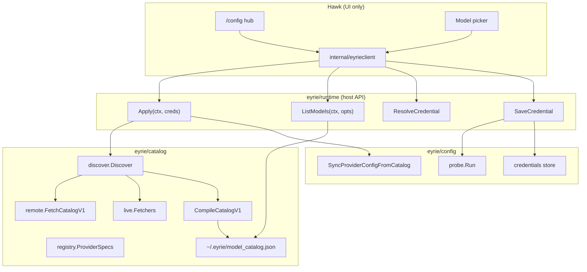

# Dynamic Model Discovery — Architecture Plan

**Status:** Implemented (2026-05-20)  
**Scope:** Eyrie (brain) + Hawk (UI face)  
**Goal:** One dynamic, provider-agnostic pipeline for credentials → model discovery → picker → chat — no hawk hardcoding, no per-provider forks in UI code.

---

## 1. Principles

| Principle | Meaning |
|-----------|---------|
| **Eyrie owns truth** | Providers, deployments, env vars, probes, model sources, catalog merge, routing |
| **Hawk owns UX** | Paste key, hub, pickers, errors display — calls `eyrieclient` only |
| **Catalog-driven** | New provider = data + one fetcher registration, not hawk changes |
| **Three-layer models** | Remote catalog → live API enrichment → compiled cache |
| **Secrets never on disk in routing** | Keychain/env store only; `provider.json` is routing metadata |
| **Fail loud, recover gracefully** | Actionable errors; UI returns to correct step (URL screen, provider list, hub) |
| **Live when configured** | If provider has a list API and credentials, prefer live over stale remote rows |

---

## 2. Current state (honest audit)

### What works today

```
User → Hawk /config
     → ResolveCredential / SaveCredential / ApplyCredentials
     → catalog.DiscoverCatalog (remote JSON + optional live fetch)
     → ~/.eyrie/model_catalog.json (compiled)
     → ~/.hawk/provider.json (deployments + routing)
     → SetupUI / ListModels → model picker
```

### What's fragmented

| Area | Problem |
|------|---------|
| **Live fetch** | Only OpenRouter, CanopyWave, Ollama — others rely 100% on remote JSON |
| **Ollama** | Special path in hawk (`LiveOllamaModelOptions`) bypassing unified `ListModels` |
| **Registry drift** | `CredentialProviderRegistry`, `liveDiscoverableDeployments`, `DefaultDeploymentEnvFallbacks` are three separate maps |
| **Layering** | Hawk imports `eyrie/catalog`, `eyrie/config`, `eyrie/setup` directly in several files despite `eyrieclient` facade |
| **Legacy API** | `FetchModelCatalog` / `providers.go` slices coexist with catalog v1 |
| **Merge policy** | Add-only merge — live pricing/metadata never updates existing remote IDs |
| **Display names** | `BuildSetupUI` has partial hardcoded provider labels |
| **Docs** | `CREDENTIAL-SETUP-FLOW.md` out of date (7 vs 8 providers, Ollama wording) |

---

## 3. Target architecture

### 3.1 High-level diagram



### 3.2 Single source of provider metadata

Replace three scattered maps with **one declarative spec** consumed everywhere:

```go
// eyrie/catalog/registry/provider_spec.go

type ProviderSpec struct {
    ProviderID       string
    DisplayName      string
    DeploymentID     string
    SortOrder        int

    // Credentials
    RequiresKey      bool
    CredentialEnv    string            // e.g. ANTHROPIC_API_KEY
    KeyPrefixes      []string
    LocalEnv         []string          // e.g. OLLAMA_BASE_URL (non-secret)

    // Validation
    Probe            ProbeSpec         // kind, base URL, timeout

    // Model discovery
    ModelSource      ModelSourceSpec   // remote | live | hybrid | local-only
    LiveListFetcher  string            // registry key → fetcher func
}

type ModelSourceSpec struct {
    Strategy   string // "remote_catalog" | "live_api" | "remote_then_live" | "live_only"
    PreferLive bool   // when both exist, live wins on conflict
}
```

**Bootstrap:** `ProviderRegistry()` returns specs; code generators / init functions derive:
- `CredentialProviderRegistry` (paste-key subset)
- `DefaultDeploymentEnvFallbacks`
- `liveDiscoverableDeployments`
- `EnsureCredentialRegistryInCatalog` merges into catalog v1

No provider-specific `if provider == "ollama"` outside registry + fetcher files.

---

## 4. Folder structure (proposed)

```
eyrie/
├── catalog/
│   ├── registry/                    # NEW — single provider spec source
│   │   ├── provider_spec.go         # ProviderSpec types
│   │   ├── providers.go             # All registered providers (data)
│   │   ├── derive.go                # Build env fallbacks, credential rows from specs
│   │   └── provider_spec_test.go
│   │
│   ├── discover/                    # NEW — orchestration (move from root catalog/)
│   │   ├── discover.go              # DiscoverCatalog entry
│   │   ├── merge.go                 # Merge policy (configurable)
│   │   └── enrich.go                # Live enrichment coordinator
│   │
│   ├── live/                        # NEW — all live model list fetchers
│   │   ├── registry.go              # deployment/provider → FetchFunc
│   │   ├── openai_compat.go         # OpenAI, OpenRouter, Grok, CanopyWave, OpenCode Go
│   │   ├── anthropic.go
│   │   ├── gemini.go
│   │   ├── ollama.go
│   │   └── live_test.go
│   │
│   ├── remote/                      # Remote catalog fetch + cache paths
│   │   ├── fetch.go
│   │   └── cache.go
│   │
│   ├── v1/                          # Schema, compile, validate (from v1.go split)
│   │   ├── schema.go
│   │   ├── compile.go
│   │   └── bootstrap.go
│   │
│   └── legacy/                      # Deprecated — tests/fixtures only
│       ├── model_catalog.go
│       └── providers.go
│
├── config/
│   ├── credential/                  # NEW — group credential files
│   │   ├── resolve.go
│   │   ├── probe.go
│   │   ├── commit.go
│   │   ├── local.go
│   │   └── errors.go
│   └── ...
│
├── runtime/                         # ONLY package hawk imports
│   ├── runtime.go                   # Load, Apply, Discover
│   ├── models.go                    # ListModels (unified)
│   ├── credentials.go               # Save, Resolve, ListProviders
│   └── selection.go                 # Active model/provider
│
└── setup/
    ├── apply_credentials.go
    └── setup_ui.go                  # Display names from ProviderSpec

hawk/
├── internal/
│   ├── eyrieclient/                 # Strict facade — ALL eyrie access
│   │   ├── host.go                  # Apply, Discover, Save, Resolve
│   │   ├── models.go                # ListModels, ListModelsLive, SetupUI
│   │   ├── credentials.go
│   │   └── catalog.go
│   │
│   └── config/                      # Hawk-only settings (no eyrie/catalog imports)
│       ├── settings.go
│       └── startup.go
│
└── cmd/
    └── chat_config_*.go             # UI only → eyrieclient
```

---

## 5. Hawk ↔ Eyrie communication contract

### 5.1 Rule: hawk imports only `eyrie/runtime` via `internal/eyrieclient`

| Hawk need | Eyrie API | Returns |
|-----------|-----------|---------|
| First-run / refresh | `runtime.Apply(ctx, creds)` | `ApplyResult{Catalog, Provider, Setup}` |
| List models for picker | `runtime.ListModels(ctx, ListModelsOpts)` | `[]ModelEntry` |
| Paste key → providers | `runtime.ResolveCredential(ctx, secret)` | `CredentialResolveResult` |
| Save key / Ollama URL | `runtime.SaveCredential(ctx, inference, value)` | `error` |
| All providers for hub | `runtime.ListProviderSetupOptions(ctx)` | `[]ProviderSetupOption` |
| Active model | `runtime.ActiveModel(ctx)` | `string` |
| Deployment status | `runtime.DeploymentRows(ctx)` | `[]DeploymentRow` |

### 5.2 New unified list API

```go
// eyrie/runtime/models.go

type ListModelsOpts struct {
    ProviderID   string // required filter
    Source       ListModelSource // "auto" | "cache" | "live"
    Refresh      bool   // force Discover before list
}

type ListModelSource string

const (
    ListSourceAuto  ListModelSource = "auto"  // spec-driven: live if configured else cache
    ListSourceCache ListModelSource = "cache"
    ListSourceLive  ListModelSource = "live"  // hit provider API; fail if unavailable
)

type ModelEntry struct {
    ID          string `json:"id"`
    DisplayName string `json:"display_name"`
    ProviderID  string `json:"provider_id"`
    Source      string `json:"source"` // "remote" | "live" | "merged"
    Installed   bool   `json:"installed,omitempty"` // ollama: true; cloud: omitempty
}

func ListModels(ctx context.Context, opts ListModelsOpts) ([]ModelEntry, error)
```

**Hawk never calls `catalog.FetchOllamaModels` directly** — always `eyrieclient.ListModels(ctx, ListModelsOpts{ProviderID: "ollama", Source: ListSourceAuto})`.

### 5.3 Setup flow messages (tea)

Keep async pattern; hawk maps opaque errors via:

```go
// eyrie/runtime/errors.go
func FormatSetupError(providerID string, err error) string
```

Provider-specific friendly text lives in eyrie, not hawk cmd.

---

## 6. Model discovery strategy per provider

| Provider | Credential | Probe | Model strategy | Live API | Edge notes |
|----------|------------|-------|----------------|----------|------------|
| **Anthropic** | `ANTHROPIC_API_KEY` | `GET /v1/models` | `remote_then_live` | Add `/v1/models` fetcher | Prefix `sk-ant-`; rate limits on list |
| **OpenAI** | `OPENAI_API_KEY` | `GET /v1/models` | `remote_then_live` | `/v1/models` | Org-scoped model lists differ |
| **Gemini** | `GEMINI_API_KEY` | `GET /v1beta/models` | `remote_then_live` | Gemini models API | Key in query param |
| **OpenRouter** | `OPENROUTER_API_KEY` | `GET /models` | `live_only` (fallback remote) | Already live | Largest dynamic catalog |
| **Grok/xAI** | `XAI_API_KEY` | `GET /v1/models` | `remote_then_live` | `/v1/models` | OpenAI-compatible |
| **CanopyWave** | `CANOPYWAVE_API_KEY` | Add probe | `live_only` | Already live | Provider ID `z-ai` alias |
| **OpenCode Go** | `OPENCODEGO_API_KEY` | Add probe | `remote_then_live` | OpenAI-compat `/models` | Custom base URL env |
| **Ollama** | `OLLAMA_BASE_URL` | `GET /api/tags` | `live_only` | Already live | Zero models = error; no remote fallback in picker |

### Strategy definitions

- **`remote_catalog`** — Use compiled cache from langdag.com JSON only.
- **`live_only`** — Must fetch from provider; empty/error fails setup (Ollama, OpenRouter primary).
- **`remote_then_live`** — Remote bootstrap for metadata; live merge adds/updates IDs user can actually call.
- **`live_only` picker filter** — For Ollama: never show remote catalog models user hasn't installed.

---

## 7. Discover pipeline (detailed)

```
DiscoverCatalog(ctx, opts)
│
├─1─ Load base catalog
│     ├─ RefreshRemote? → GET langdag.com/.../catalog.json
│     └─ else → ~/.eyrie/model_catalog.json or bootstrap
│
├─2─ Ensure registry deployments in catalog (from ProviderSpec)
│
├─3─ Resolve credentials
│     ├─ opts.Credentials (from Apply)
│     └─ fallback: credential store only (never process env in production path)
│
├─4─ Live enrichment (for each configured deployment with live fetcher)
│     ├─ Skip if no credential env satisfied
│     ├─ Call live.Fetch(deploymentID, env)
│     ├─ Record LiveProviderEnrichment (count or error)
│     └─ Merge per strategy (see §8)
│
├─5─ Write cache + CompileCatalogV1
│
└─6─ Fail if zero models total (unless bootstrap-only dev mode)
```

---

## 8. Merge policy (fix staleness)

Current: **add-only** — live never updates existing IDs.

Target: **strategy-aware merge**

```go
type MergePolicy struct {
    OnIDConflict   string // "keep_remote" | "prefer_live" | "union"
    UpdateFields   []string // pricing, context_window, max_output when prefer_live
}
```

Default per provider from `ModelSourceSpec`:
- OpenRouter, Ollama: `prefer_live`
- Anthropic, OpenAI: `prefer_live` for pricing/context when live returns data
- Remote-only providers: `keep_remote`

---

## 9. Edge cases — complete matrix

### 9.1 Credentials

| Case | Expected behavior |
|------|-------------------|
| Empty paste | Reject before provider list |
| Placeholder key (`your-api-key`) | Reject with clear message |
| Wrong prefix for chosen provider | `ValidateCredentialSecret` fails on save |
| Valid key, probe 401 | "Authentication failed — check key" |
| Valid key, probe timeout | Retry once; then friendly timeout message |
| Probe OK, discover fails (network) | Save key; show "catalog refresh failed" with retry |
| Key saved, user cancels model pick | Credentials kept; `NeedsSetup` until model selected |
| Switch provider with existing key | Hub → paste new key → discover → picker |
| Ollama URL invalid | Reject at URL validation |
| Ollama down | Return to URL screen with hint (`ollama serve`) |
| Ollama up, zero models | Error: `ollama pull …`; stay on URL screen |
| Ollama remote URL (LAN/VPN) | Same probe/fetch; validate URL scheme/host |
| Secure credentials off | Removed — keychain-only; legacy env files migrated once on startup |

### 9.2 Model listing

| Case | Expected behavior |
|------|-------------------|
| Cache stale | Background refresh (`catalog_startup`); picker uses cache until refresh completes |
| Cache empty for provider | Auto-discover once; then list |
| Live returns empty (cloud) | Fall back to remote catalog entries |
| Live returns empty (Ollama) | Error — no remote fallback in picker |
| Provider not in registry | Not shown in paste-key list; may exist in remote catalog for routing |
| Model ID alias vs canonical | `CanonicalModelForAliasOrID` at selection time |
| User picks model from wrong provider | Filter picker by `providerFilter` always after credential apply |
| Concurrent discover | Mutex on cache write; second call waits or returns in-flight result |

### 9.3 UI / hawk

| Case | Expected behavior |
|------|-------------------|
| Async save in progress | `configSaving` locks hub/lists |
| Error on save | Return to correct step (URL / provider / hub) per provider type |
| Empty model list | Show notice in picker + esc → hub |
| `/config` with existing creds | Hub: Pick model \| Paste key \| Ollama |
| `/model` quick switch | Model picker; esc → hub |
| First run auto-open | Hub when `NeedsSetup` |

### 9.4 Security

| Case | Expected behavior |
|------|-------------------|
| Secrets in provider.json | Never — sanitize on sync |
| Secrets in process env | Never applied from store (deprecated `ApplyToProcess`) |
| Logs | Never log secret values; probe errors truncate body (512 bytes) |
| Env file fallback | Removed — one-time migration from `~/.hawk/env` into keychain |
| Catalog URL override | `EYRIE_MODEL_CATALOG_URL` — HTTPS only in production builds |

### 9.5 Performance

| Case | Expected behavior |
|------|-------------------|
| Cold start | Load cache from disk (<50ms); background refresh if stale |
| After key paste | Single discover (90s timeout); probe parallel where multiple deployments |
| Model picker open | Serve from cache; optional `ListSourceLive` for Ollama refresh button |
| Large OpenRouter list | Virtual scroll (existing `configWindowSize`); cache in memory |
| Repeated /config | `modelCache` per provider in hawk (invalidate on Apply) |

---

## 10. Central reusable modules

### 10.1 `catalog/live/openai_compat.go`

One fetcher for all OpenAI-compatible list endpoints:

```go
func FetchOpenAICompatModels(ctx context.Context, cfg OpenAICompatFetchConfig) ([]ModelCatalogEntry, error)
```

Used by: OpenAI, OpenRouter, Grok, CanopyWave, OpenCode Go, Ollama (separate tags API).

### 10.2 `config/credential/probe.go`

```go
func RunProbe(ctx context.Context, spec ProbeSpec, env map[string]string) error
```

Maps `ProbeKind` → HTTP client; shared timeout, retry, error formatting.

### 10.3 `runtime/models.go`

Single entry for all hosts (hawk, CLI, SDK):

```go
ListModels(ctx, opts)
DiscoverAndList(ctx, providerID)
SetupUI(ctx, providerFilter)
```

### 10.4 `setup/setup_ui.go`

- Display names from `ProviderSpec.DisplayName`
- Sort from `ProviderSpec.SortOrder`
- No hardcoded switch for provider labels

---

## 11. Implementation phases

### Phase 0 — Hygiene (1–2 days)
- [ ] Update `CREDENTIAL-SETUP-FLOW.md` to match code (8 providers, Ollama path)
- [ ] Fix `displayNameForProvider` to read registry
- [ ] Document current API in `hawk/docs/DYNAMIC-MODELS.md`

### Phase 1 — Unify hawk access (2–3 days)
- [ ] Move `LiveOllamaModelOptions`, direct catalog imports → `eyrieclient`
- [ ] Hawk cmd imports only `eyrieclient` + `hawk/internal/config`
- [ ] Add `runtime.FormatSetupError(provider, err)`

### Phase 2 — Provider registry (3–5 days)
- [ ] Create `catalog/registry/` with `ProviderSpec`
- [ ] Derive credential registry, env fallbacks, live registry from specs
- [ ] Delete duplicated maps after migration tests pass

### Phase 3 — Unified ListModels (3–4 days)
- [ ] Implement `runtime.ListModels(ctx, ListModelsOpts)` with `Source: auto`
- [ ] Ollama `live_only` enforced inside runtime (remove hawk special case)
- [ ] Hawk picker uses single `eyrieclient.ListModels` path

### Phase 4 — Live fetchers for all cloud providers (5–7 days)
- [ ] Anthropic, OpenAI, Gemini, Grok live fetchers
- [ ] OpenCode Go probe + live fetch
- [ ] CanopyWave probe (replace `probe_none`)
- [ ] Register all in `catalog/live/registry.go`

### Phase 5 — Merge policy + cache (2–3 days)
- [ ] Strategy-aware merge (`prefer_live` for pricing/context)
- [ ] Discover mutex / in-flight dedup
- [ ] Enrichment metadata surfaced in SetupUI (`source` badge optional in UI)

### Phase 6 — Folder reorg (2–3 days)
- [ ] Move files per §4 (can be incremental with re-exports)
- [ ] Move legacy catalog API to `catalog/legacy/`; mark deprecated
- [ ] Remove hot-path usage of `FetchModelCatalog`

### Phase 7 — Tests + observability (ongoing)
- [ ] Table-driven tests per provider spec (probe, live, merge, list)
- [ ] httptest mock server shared fixtures in `catalog/live/testdata/`
- [ ] `Discover` enrichment logged: `{provider, model_count, error, duration_ms}`

---

## 12. Testing strategy

```
eyrie/catalog/registry/provider_spec_test.go   — spec completeness, no orphan deployments
eyrie/catalog/live/*_test.go                  — each fetcher with httptest
eyrie/catalog/discover/discover_test.go       — remote + live + merge scenarios
eyrie/config/credential/probe_test.go         — all probe kinds
eyrie/runtime/models_test.go                  — ListModels auto/live/cache
hawk/internal/eyrieclient/models_test.go      — facade contract
hawk/cmd/chat_config_*_test.go                — hub flows (mock eyrieclient)
```

**Fixture principle:** Provider HTTP responses live in JSON files under `testdata/providers/{provider}/`, not inline in every test.

---

## 13. Adding a new provider (future checklist)

1. Add models to remote catalog source (langdag.com) **or** rely on live-only.
2. Add one `ProviderSpec` row in `catalog/registry/providers.go`.
3. If live list API exists: implement fetcher in `catalog/live/` and register key.
4. Run `go test ./catalog/... ./runtime/...`.
5. **No hawk changes** — hub and picker populate from `runtime.ListProviderSetupOptions` and `ListModels`.

---

## 14. Communication cheat sheet (for hawk developers)

```go
// Refresh everything after user saves a credential
result, err := eyrieclient.ApplyCredentials(ctx)

// Model picker (auto = spec-driven live vs cache)
models, err := eyrieclient.ListModels(ctx, eyrieclient.ListModelsOpts{
    ProviderID: "anthropic",
    Source:     eyrieclient.ListSourceAuto,
})

// Paste-key flow
res := eyrieclient.ResolveCredential(ctx, secret)
err := eyrieclient.SaveCredential(ctx, inference, secret)

// Local provider (Ollama) — same SaveCredential, RequiresKey=false in inference
inf, _ := eyrieclient.LocalCredentialInference("ollama")
err := eyrieclient.SaveCredential(ctx, inf, baseURL)

// User-facing error
msg := eyrieclient.FormatSetupError("ollama", err)
```

---

## 15. Success criteria

- [ ] Zero provider-specific branches in `hawk/cmd/chat_config_*.go`
- [ ] Zero hawk imports of `eyrie/catalog`, `eyrie/setup`, `eyrie/config` outside `eyrieclient`
- [ ] All 8 registry providers have documented model source strategy
- [ ] Ollama never shows uninstalled remote catalog models
- [ ] Live-capable providers enrich catalog on every Apply
- [ ] New provider = 1 spec row + optional 1 fetcher file + remote catalog entry
- [ ] Full `/config` flow tested: hub → credential → discover → picker → chat

---

## 16. Related docs

- `eyrie/plans/CREDENTIAL-SETUP-FLOW.md` — paste-key wizard (update in Phase 0)
- `hawk/docs/DYNAMIC-MODELS.md` — hawk integration guide (update in Phase 1)
- `eyrie/README.md` — env vars and provider table
